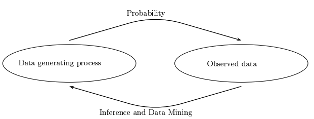
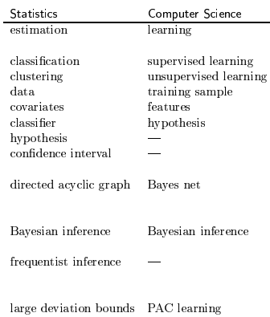

* __Statistics, Data Mining and Machine Learning__ are all concerned with collecting and analyzing data.
  * Statistics research: statistic department
  * data mining, mechine learning: computer science department

# 1. Difference between Probability and Statistics?

* The basic problem of probability: Given a __data generating process__, what are the properties of the outcomes?

* The basic problem of Statistics: Given the __outcomes / observed data__, what can we say about the process that generated the data?

* Summary: The basic problem of probability and statistics are inversed.

  

# 2. Different language of Statisticans and computer scientists

# 3. Some Notation and Formula

* $ e^x = \sum_\limits{k=0}^{\infty} \frac{x^k}{k!}$
* $\frac{x^k}{1-x} = \sum\limits_{j=k}^{\infty}x^j\ \ (0< r <1)$
* $e^a = \lim\limits_{n \rightarrow \infty}(1 + \frac{a}{n})^n$
* $\Gamma(\alpha) = \int_0^{\infty} y^{\alpha-1}e^{-y} {\rm d}y$    ($\Gamma(\frac{1}{2}) = \sqrt\pi$)
